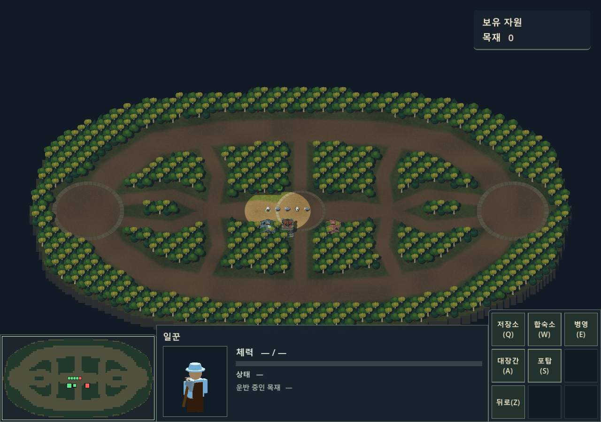
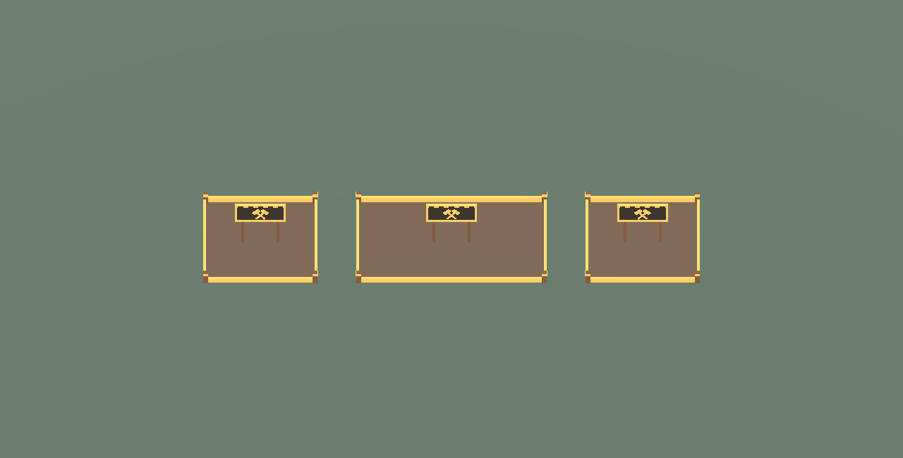
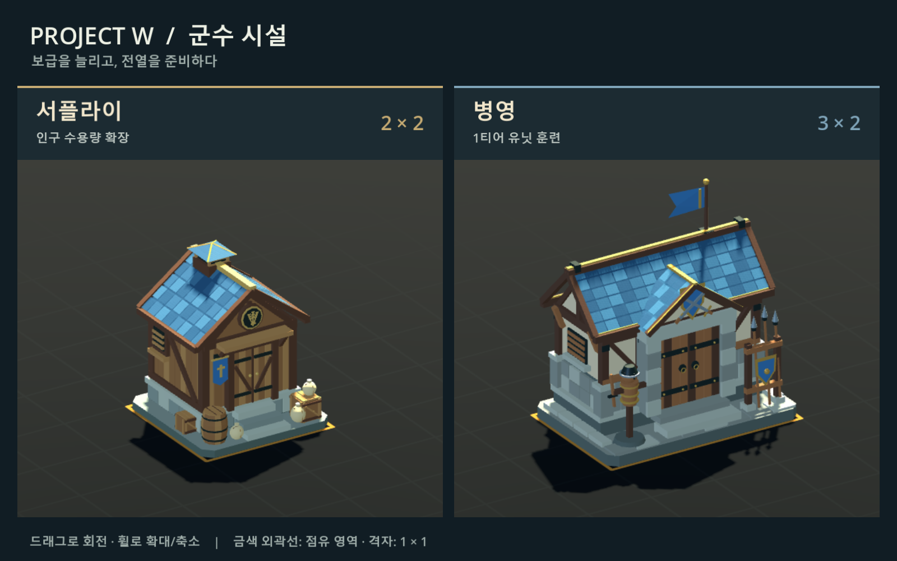
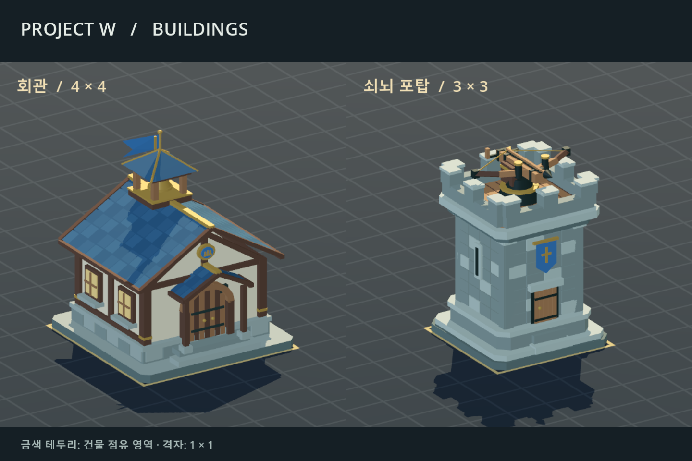

# 건물

| 씬 | 타입 | 점유 크기 | 높이 | 외형 |
| --- | --- | --- | --- | --- |
| `TownHall.tscn` | 0 | 5×5 | 약 5.98 | 석조 기단·목조 회관·푸른 슬레이트 지붕·종탑 |
| `Fortress.tscn` | 1 | 4×4 | 약 5.96 | 기존 포탑을 요새로 구분. 석조 망루·총안·진영 깃발·상부 대형 쇠뇌 |
| `Store.tscn` | 2 | 3×3 | 약 3.30 | 자원 창고·큰 적재문·도르래·상자·곡물 자루·통나무 더미 |
| `Supply.tscn` | 3 | 3×3 | 약 4.09 | 2층 합숙소·회벽과 목조 골조·창문·굴뚝·현관 벤치 |
| `Barracks.tscn` | 4 | 5×3 | 약 4.83 | 석조 기단·목조 훈련소·방패와 교차 검·무기 거치대·훈련 허수아비 |
| `Forge.tscn` | 5 | 5×3 | 약 4.64 | 석조 화덕·높은 굴뚝·모루·망치·철괴 작업대·냉각통·검 거치대 |
| `Tower.tscn` | 6 | 3×3 | 약 3.84 | 유저 건설용 간이 포탑·목조 지지대·사다리·난간·작은 회전 쇠뇌 |

모두 루트 스케일은 1, 바닥은 Y=0, 모델 원본의 정면은 -Z입니다. 메시 원본을 다시 모델링하지 않고 Visual과 Turret의 스케일로 서버 크기에 맞춰 확대합니다. 선택용 Area3D는 물리 레이어 4(값 8), `footprint` 메타데이터는 표의 가로(X)·깊이(Z)입니다. 선택 원은 직사각형 대각선 길이에 맞춰 계산합니다.

서버에 등록된 건물의 Visual은 플레이어 카메라의 수평 시선 방향을 향합니다. 같은 직교 카메라의 화면을 이동해도 건물마다 제각각 회전하지 않습니다. 서버 yaw는 Entrance 방향에 적용하며 루트와 점유 영역은 회전하지 않아 서버의 축 정렬 충돌 영역과 일치합니다. 대기 중인 Turret은 건물 정면을 따르고 공격 중에는 서버 대상에 맞춰 별도로 조준합니다. 서버에 연결하지 않는 모델 미리보기는 원래 정면과 회전 관찰 기능을 유지합니다.

`BuildingCatalog`와 서버 `building_defs.go`는 회관 0, 요새 1, 저장소 2, 합숙소 3, 병영 4, 대장간 5, 포탑 6 순서를 공유합니다. 저장소·합숙소·병영·대장간·포탑은 내 일꾼의 1티어 메뉴에서 BUILD를 요청하고, 서버의 BUILDING/CONSTRUCTION 응답으로 부지와 진행률을 반영합니다.

표시 이름 `합숙소`는 기존 `Supply.tscn`을 사용합니다. 저장소의 기본 경로는 `buildings/Store.tscn`, `previews/Store.tscn`, `tools/build_store.gd`이며 이름 키는 `store`입니다. 대장간은 `buildings/Forge.tscn`, `previews/Forge.tscn`, `tools/build_forge.gd`와 `forge`를 사용합니다. 대장간은 병영과 같은 5×3이고 화덕의 불은 정적인 발광 메시입니다. 비용·공사·완공 외에 합숙소 인구수와 회관·병영 생산·취소·랠리도 연결되어 있습니다. 저장소의 추가 반납·보관 경제와 대장간 제작/업그레이드는 아직 없습니다.

새 건물은 장식을 포함해 하나의 ArrayMesh로 묶었습니다. 합숙소는 삼각형 2,382개·재질 14개, 저장소는 5,566개·13개, 병영은 6,327개·13개, 대장간은 4,560개·15개입니다. 재질의 `banner` 영역은 기존 건물과 동일하게 인스턴스별 진영색을 지원합니다. 네 건물 모두 기본 Entrance는 (0,0,-1.5), 완성된 건물의 체력바 위치는 확대된 전체 모델 높이 위에 있습니다.

회관 기본 Entrance는 (0,0,-2.5)에 있습니다. 중심이 현재 본진 좌표 (-65,0), (65,0)이므로 서버 충돌도 중심 ±2.5의 5×5입니다. 서버의 일꾼 생성 위치와 자원 반납 위치는 이 크기로 계산합니다.

기존 석조 포탑은 `Fortress.tscn`으로 분리하고 선택창에서 `요새`로 표시하며 현재 크기는 4×4입니다. 기존 서버 타입 1과 배치·전투 방식은 유지합니다. `Tower.tscn`은 유저 건설용인 타입 6의 3×3 목조 간이 포탑입니다. 요새는 시작 전용 건물로 건설 메뉴에 넣지 않습니다.

두 방어시설 모두 Visual은 구조물이며 Turret/Ballista는 독립된 회전부, Turret/Muzzle은 발사 위치입니다. 요새 쇠뇌는 정지 상태에서 회전 반경 2 이내입니다. 간이 포탑의 쇠뇌는 확대된 회전과 반동을 포함해 반경 1.5 이내에 머뭅니다. 각각 별도 아군·적군 초상화를 사용합니다.

현재 서버는 진영별 상·하단 라인에 각각 2기씩, 총 8기의 요새(기존 타입 1 포탑)를 생성합니다. 4×4 점유 영역이 주변 나무와 겹치지 않도록 `maps/test.json`의 좌표를 (±47, ±28), (±20, ±29)로 맞췄습니다. 지형·나무·라인은 유지하며 서버와 클라이언트가 같은 맵을 사용합니다. 현재 SHA-256은 `03ca213a48b82ce52b79692cee9b49c1fdb52603c27245d6e8cd105c44ef972b`입니다. 클라이언트는 `towers`로 건물을 자체 생성하지 않고 서버 스냅샷을 기다립니다.

## 영어 이름 추천

저장소는 사용자 지정 이름 `Store`(키 `store`), 대장간은 `Forge`(키 `forge`)를 사용합니다. 다른 영문 표시명은 아래를 권장하며, 통신에는 이름 대신 타입 번호를 보냅니다.

| 건물 | 추천 이름 | 의도 |
| --- | --- | --- |
| 회관 | **Town Hall** | 마을과 진영의 중심 건물 |
| 요새 | **Fortress** | 기존의 크고 견고한 석조 방어시설 |
| 저장소 | **Store** | 목재·곡물 등 자원을 보관하는 창고 외형 |
| 합숙소 | **Quarters** | 병사들이 머무는 숙소라는 역할을 강조 |
| 병영 | **Barracks** | 병사를 모집·훈련하는 시설 |
| 대장간 | **Forge** | 대장장이가 일하는 작업장 |
| 간이 포탑 | **Tower** | 작은 목조 방어탑 |

합숙소의 파일명과 서버 상수는 기존 `Supply`를 유지하고 게임 안에서는 `합숙소`로 표시합니다.

## 표시와 서버 연결

```text
BUILDING type id sideId x z yaw
CONSTRUCTION id percent payerId
HP id current maximum
STATE id IDLE|ATTACK 0 targetId swingSequence
REMOVE id
```

BuildingManager는 위 표의 타입 0~6을 등록하며 클라이언트에서 건물을 임의 생성하지 않습니다. 현재 서버 최대 체력은 회관 1800, 요새 1000, 저장소·합숙소 400, 병영·대장간 800, 간이 포탑 700입니다. UI에는 이 숫자를 고정하지 않고 HP 메시지를 적용합니다. 저장소·합숙소는 목재 150/18초, 병영·대장간은 목재 200/21초, 간이 포탑은 목재 200/30초이며 저장소·대장간 값은 승인된 임시 수치입니다. 실제 비용 지불과 완료 판정은 서버가 처리합니다.

## 건설 배치

내 일꾼을 선택하고 Z / 넘패드 1 위치의 `1티어` 버튼으로 건설 메뉴를 엽니다. Q(7번)는 저장소, W(8번)는 합숙소, E(9번)는 병영, A(4번)는 대장간, S(5번)는 포탑입니다. Z / Esc로 기본 패널에 돌아갑니다. 메뉴가 열려 있는 동안 A는 대장간 선택이며 Q/W/S/D 문자 카메라 이동은 멈춥니다. [명령 패널](../docs/command-panel.md)을 참고하세요.



건물을 고르면 반투명 미리보기가 나타납니다. 다른 유닛과 함께 선택해도 내 일꾼이 있으면 건설할 수 있습니다. 여러 일꾼 중 ID가 가장 작은 한 기를 사용하고, 배치 중 해당 일꾼이 선택에서 빠지거나 사라지면 취소합니다. 지면 Y=0에 건물 중심을 놓고 점유 영역의 가장자리를 맵 격자에 맞춥니다. 저장소·합숙소·포탑은 3×3, 병영·대장간은 5×3이며 x/z는 점유 영역의 중심입니다. 좌클릭하면 한 번 요청하고 배치 모드를 종료합니다. 우클릭·Esc·창 포커스 이탈로 취소하며 UI 위에서는 미리보기를 숨기고 건설하지 않습니다. 공격 모드, 부대 선택, 미니맵 이동, 맵 재동기화·연결 종료도 배치 모드를 정리합니다.

```text
BUILD 건물타입 x z 일꾼ID
BUILD 2 -8.5 -4.5 101
BUILD 3 -4.5 -4.5 101
BUILD 4 -4.5 -8.5 101
BUILD 5 -10.5 -8.5 101
BUILD 6 -14.5 -4.5 101
```

`PlacementRules`는 전체 점유 영역이 맵 안에 있는지, 벽·남아 있는 나무·서버가 알려준 건물·현재 알려진 유닛과 겹치는지 검사합니다. 불가능한 곳은 빨간 미리보기와 사유를 표시하고 클릭해도 전송하지 않습니다. 나무의 2×2 점유 영역과 벌목 후 제거, 건물의 축 정렬 직사각형 크기를 반영합니다. 건물의 시각적인 정면과 서버 yaw는 점유 영역을 돌리지 않습니다. 유닛은 화면 보간 위치 대신 최신 수신 좌표와 선택 영역의 반경을 사용해 보수적으로 검사합니다. 화면에 알려지지 않은 적, 서버의 실제 충돌 반경·비용·건설 범위·동시 요청은 최종 서버 검사가 필요합니다.

배치 미리보기는 `ui/build-previews/`에 미리 렌더한 투명 PNG를 사용합니다. 게임 시작 때 이미지를 읽고 같은 표시 노드와 텍스처를 계속 재사용하므로 건설 버튼을 누를 때 건물 씬·메시·재질을 새로 만들지 않습니다. 화면 위치와 크기는 카메라 투영으로 계산해 이동·줌·창 크기 변경에 맞추고, 점유 영역 테두리와 가능/불가 색상도 갱신합니다. 현재 게임의 고정 카메라 방향으로 만든 이미지이므로 모델이나 카메라 회전각을 바꾸면 다시 생성해야 합니다.

미리보기는 실제 건물·충돌·체력·시야 목록에 추가하지 않습니다. 요청 후 자원도 임의 차감하지 않습니다. 일꾼이 도착해 서버가 부지를 세우면 BUILDING 바로 뒤에 CONSTRUCTION 0을 보내며, 그때 실제 공사 부지를 표시합니다. ERR은 화면 알림으로 전달합니다.

## 공사 표시와 이어 짓기

모든 건물은 `ConstructionSite.cs`의 공통 테두리·모서리 말뚝·중앙 팻말로 공사 중임을 표시합니다. 테두리는 서버와 같은 축 정렬 점유 영역을 따르고 글자 없는 팻말은 카메라를 향합니다. 부지에는 `공사 중` 글자나 퍼센트를 띄우지 않습니다. 건물마다 공사 단계 모델을 만들지 않습니다. 공사 중에는 완성 Visual/Turret을 숨기고 선택 영역과 체력바 높이도 낮춥니다.



`CONSTRUCTION id percent payerId`의 정수 0~100을 선택 상세정보 창에 표시하며 100에서 완성 모델·선택 영역·체력바 높이를 복원합니다. payerId는 공사비를 지불한 플레이어입니다. 중단되면 별도 상태 메시지 없이 마지막 진행률을 유지합니다. HP는 공사 중에도 피해를 입을 수 있으므로 진행률을 HP에서 계산하지 않습니다. 처음부터 완성된 건물은 CONSTRUCTION을 받지 않습니다. 접속 스냅샷은 BUILDING 이후 미완성 건물에만 현재 진행률과 비용 지불자를 보내고, 중복 BUILDING으로 공사 상태를 초기화하지 않습니다.

비용 지불자는 미완성 부지를 선택한 뒤 명령 패널의 `건설 취소(Esc)`로 `CANCEL_BUILD id`를 요청할 수 있습니다. 서버는 실제 지불 비용의 75%를 자원별로 버림하여 반환하고, 부지·길막·진행 중인 건설 명령을 제거합니다. 현재 일꾼이 다른 플레이어 소유여도 환급 대상은 원래 비용 지불자입니다. 완성된 건물·적 건물·다른 플레이어가 지불한 공사·이미 제거된 부지는 취소하지 않습니다. [취소 규칙](../docs/command-panel.md#생산건설-취소)을 참고하세요.

내 일꾼을 선택해 같은 편 미완성 건물을 우클릭하면 `CONSTRUCT 건물ID 일꾼ID` 한 줄을 보냅니다. 혼합/다중 선택에서도 ID가 가장 작은 내 일꾼 한 명만 보내며 나머지 선택 유닛에는 명령하지 않습니다. 다른 플레이어 소유 일꾼은 사용할 수 없지만 같은 편의 건물에는 이어 지을 수 있습니다. 서버는 접근 중인 건설자도 예약하므로 클라이언트에서 비어 있다고 추정하지 않고, `ERR 이미 짓는 중`을 그대로 알립니다. 재개에 추가 비용은 없습니다.

일꾼은 실제 작업 중일 때 `STATE 일꾼ID BUILD 운반량 건물ID 타격번호`를 받아 작업 자세와 `건설 중` 상태를 표시합니다. 접근 중은 IDLE이며 운반량/타격번호가 0이라고 가정하지 않습니다. 다른 명령이나 사망으로 일꾼이 떠나면 서버가 공사를 멈춥니다. 건물 REMOVE는 부지·선택·대상 조회를 즉시 제거하고, 일꾼은 서버에서 뒤따르는 STATE IDLE로 작업을 멈춥니다.

sideId는 진영이며 접속 플레이어 ID와 다릅니다. 지붕과 banner 재질은 건물 인스턴스별로 복제하여 내 진영은 옅은 파랑, 상대 진영은 옅은 붉은색으로 표시합니다. 내 진영이 2여도 아군은 파랑이며 석재·목재는 원래 색을 유지합니다. [진영 색상](../docs/team-colors.md)을 참고하세요. 같은 ID의 중복 스냅샷은 위치와 진영을 갱신하고, 체력은 서버 HP, 제거는 REMOVE로 반영합니다. 건물은 REMOVE 수신 즉시 화면과 대상 조회에서 제거합니다.

STATE는 유닛·요새·포탑이 공유합니다. 완성된 요새와 포탑은 서버의 targetId를 따라 쇠뇌만 수평 회전하고, swingSequence가 바뀔 때 반동과 짧은 금색 발사 궤적을 한 번 표시합니다. 공사 중에는 서버 사격과 클라이언트 공격 연출 모두 멈춥니다. 완공 통지만으로 지난 발사를 재생하지 않으며 첫 스냅샷이나 중복 메시지도 재생하지 않습니다. 대상 UNIT이 늦게 오면 다음 프레임부터 조준합니다. 피해·사거리·재장전·대상 선택은 서버가 계산하며, 화면의 궤적은 피해 판정과 별개입니다.

건물 좌클릭은 선택 표시와 체력바를 켜고 유닛 선택을 해제합니다. 내 유닛을 선택한 상태에서 적 건물을 우클릭하거나 기본 패널에서 A → 좌클릭하면 `ATTACK 건물ID 내유닛ID...`를 보냅니다. 같은 진영 건물은 공격할 수 없으며 내 일꾼이 선택된 아군 미완성 부지는 이어 짓기, 그 밖에는 이동입니다. 유닛의 공격 대상도 건물 ID를 조회하므로 건물을 바라봅니다. 회관의 생산 버튼은 [명령 패널](../docs/command-panel.md)을 참고하세요.

## 미리보기

- `previews/ProductionBuildings.tscn`: 합숙소·저장소·병영·대장간을 동일한 화면 배율로 비교. 드래그 회전, 휠 확대/축소.
- `previews/Supply.tscn`: 3×3 합숙소 개별 미리보기.
- `previews/Store.tscn`: 3×3 저장소(자원 창고) 개별 미리보기.
- `previews/Barracks.tscn`: 5×3 병영 개별 미리보기.
- `previews/Forge.tscn`: 5×3 대장간 개별 미리보기.
- `previews/Buildings.tscn`: 5×5 회관·4×4 요새·3×3 간이 포탑을 동일한 화면 배율로 비교.
- `previews/TownHall.tscn`: 회관. 좌클릭 드래그 회전, 휠 확대/축소.
- `previews/Fortress.tscn`: 4×4 요새. 기존 포탑 외형.
- `previews/Tower.tscn`: 3×3 간이 포탑. 좌클릭 드래그 회전, 휠 확대/축소.

Godot에서 장면을 열고 F6으로 실행합니다. 금색 테두리는 점유 영역, 격자는 1×1입니다. `-- --capture`로 실행하면 docs/images/에 미리보기 이미지를 저장합니다.





## 재생성과 검증

C# 프로젝트를 빌드한 뒤 실행합니다. Godot은 설치된 .NET 실행 파일 경로로 바꿉니다.

```text
Godot --headless --path . --script tools/build_town_hall.gd
Godot --headless --path . --script tools/build_tower.gd
Godot --headless --path . --script tools/build_fortress.gd
Godot --headless --path . --script tools/build_supply.gd
Godot --headless --path . --script tools/build_store.gd
Godot --headless --path . --script tools/build_barracks.gd
Godot --headless --path . --script tools/build_forge.gd
Godot --path . res://tools/BakeBuildingPreviews.tscn
Godot --path . res://tools/BakeSelectionPortraits.tscn -- --defenses-only
```

생성 도구는 해당 씬과 buildings/meshes/의 메시를 덮어쓰므로 외형 수정은 생성 스크립트에 반영합니다. 포탑·합숙소·저장소·병영·대장간 도구는 회관 도구의 메시 생성 함수를 재사용합니다. `BakeBuildingPreviews`는 화면 렌더링이 가능한 환경에서 실행하며 투명 PNG와 크기·지면 기준점이 담긴 `catalog.json`을 함께 갱신합니다. 게임 내보내기 시에도 이 JSON을 포함해야 합니다.

자동 검증은 `./tests/run.ps1 -Suite Buildings`로 배치·공사·생산·취소·랠리·건물 전투 표시를 확인합니다. 외형은 위 미리보기에서 확인합니다. 실행 환경과 범위는 [필수 테스트 안내](../tests/README.md)를 참고하세요.
