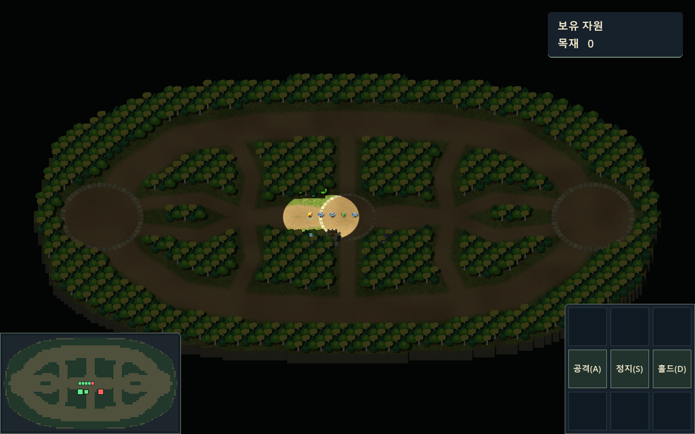
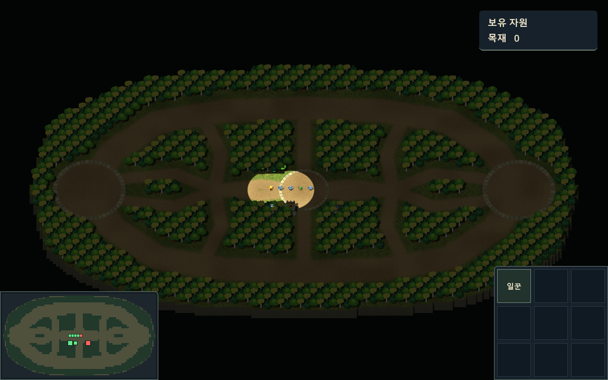

# 명령 패널

`game/Main.tscn`의 `SelectionUI/CommandPanel`에 216×216 크기의 패널을 화면 우측 하단에 붙여 표시합니다. 9칸은 넘패드 순서입니다.

```text
7 8 9
4 5 6
1 2 3
```

- 조종 가능한 내 유닛을 선택하면 4번에 `공격(A)`, 5번에 `정지(S)`, 6번에 `홀드(D)`를 표시합니다. 여러 유닛을 선택해도 같습니다.
- 선택한 내 유닛 중 일꾼이 있으면 1번에 `1티어(Z)` 버튼을 표시합니다. 이 버튼을 누르거나 Z를 누르면 아래 건설 메뉴로 들어갑니다.
- 아군 회관을 선택하면 7번에 `일꾼`을 표시합니다.
- 선택이 없거나 조종할 수 없는 유닛, 적 회관, 요새, 포탑을 선택하면 모두 빈칸입니다. 기존 타입 1 요새는 건설 대상이 아닙니다.

`UnitManager`와 `BuildingManager`의 선택 변경 이벤트로 표시를 갱신합니다. 선택 대상이 제거되거나 소유권·팀이 변경될 때, 접속이 종료되거나 맵이 다시 동기화될 때도 반영합니다.

## 1티어 건설 메뉴

| 위치 | 단축키 | 건물 | 서버 타입 | 상태 |
|---|---|---|---|---|
| 7 | Q | 저장소 (store) | 2 | 건설 가능 |
| 8 | W | 합숙소 (supply) | 3 | 건설 가능 |
| 9 | E | 병영 (barracks) | 4 | 건설 가능 |
| 4 | A | 대장간 (forge) | 5 | 건설 가능 |
| 5 | S | 포탑 (tower) | 6 | 건설 가능 |
| 1 | Z / Esc | 뒤로 | — | 기본 일꾼 패널로 복귀 |

건물 버튼이나 단축키를 누르면 기본 패널로 돌아가며 반투명 배치 미리보기를 시작합니다. 전장을 클릭하면 `BUILD 건물타입 x z 일꾼ID`를 보냅니다. 저장소·합숙소·포탑은 3×3, 병영·대장간은 5×3입니다. 포탑의 서버 수치는 목재 200·공사 30초·체력 700입니다. 점유 검사와 취소 조작은 [건설 배치](../buildings/README.md#건설-배치)를 참고하세요.

메뉴가 열려 있는 동안 A는 대장간 선택에 사용하고, 카메라의 Q/W/S/D 문자 이동은 멈춥니다. 건물을 선택한 키를 놓아야 문자 이동이 다시 켜집니다. 방향키·마우스 카메라 이동과 숫자 부대 지정은 유지합니다. 메뉴를 연 뒤 선택을 바꾸거나 부대 번호를 누르거나 창 포커스를 잃으면 기본 패널로 돌아갑니다. 반복 키 입력으로 같은 건물 요청이나 공격 모드가 중복 실행되지 않습니다.

회관의 `일꾼` 버튼을 클릭하면 기존 통신 경로로 `TRAIN 유닛타입` 한 줄을 보냅니다. 일꾼 타입은 `0`이므로 `TRAIN 0`을 보냅니다. 요청에 사용자 ID를 포함하지 않으며, 서버가 접속 정보로 요청자를 판단합니다. 줄바꿈은 `NetClient.Send`가 붙입니다.

아군 회관을 선택한 상태에서만 요청하며, 맵 동기화가 끝나지 않았으면 전송하지 않습니다. 클릭마다 요청 한 번을 보내고, 클라이언트에서 유닛을 미리 만들거나 자원을 차감하지 않습니다. 서버가 생성 후 기존 형식의 `UNIT 0 id owner x z team`을 보내면 화면에 표시됩니다. 서버는 접속 정보로 확인한 사용자의 생성 권한·비용 등을 최종 검사합니다.

기본 패널의 공격·정지·홀드 버튼은 아직 표시만 합니다. 기존 A 공격 대상 지정과 1티어 건설 단축키는 동작합니다. 패널 위의 클릭과 휠은 뒤쪽 전장으로 전달되지 않으며, 건설 모드에서도 UI 뒤에 건물을 배치하지 않습니다.

검증: `dotnet build --no-restore`, `tests/CommandPanelChecks.tscn`, `tests/UnitSceneChecks.tscn`, `tests/TowerSyncChecks.tscn`. 명령 패널 검증은 메뉴 배치, 다섯 건물의 클릭/키보드 타입 대응, A 충돌 방지, 키 반복, 취소와 재접속을 포함합니다. `CommandPanelChecks.tscn`을 정상 그래픽 렌더러로 실행하고 `-- --command-panel-capture`를 추가하면 `.godot/command-panel-unit.png`와 `.godot/command-panel-hall.png`를 저장합니다.




