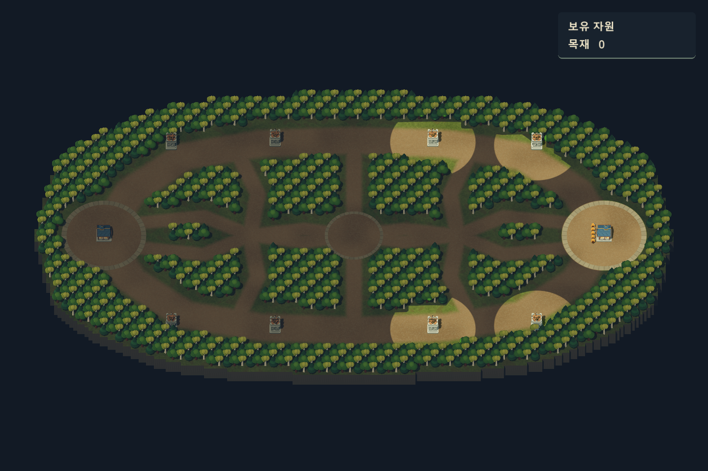

# 전장의 안개 동기화와 서버 성능 점검

서버와 Godot C# 클라이언트는 같은 맵을 사용합니다. 2026-09-30에 4×4 요새의 배치 좌표를 조정했으며, 양쪽 맵의 SHA-256은 `03ca213a48b82ce52b79692cee9b49c1fdb52603c27245d6e8cd105c44ef972b`입니다. 지형·나무·라인 데이터는 유지했습니다.

## 동작

- 같은 진영의 유닛·미니언·건물이 시야를 공유합니다. 소유자 ID가 아닌 WELCOME의 진영을 사용합니다.
- 현재 서버 시야 반경은 유닛 8, 회관·포탑 12입니다. **적 유닛의 실제 좌표**가 아군의 반경 안에 있고 그곳까지 장애물이 없을 때만 보입니다. 서버는 빈 땅의 시야를 계산하지 않습니다. 나무·벽·다른 건물의 점유 칸과 그 뒤쪽은 시야가 차단됩니다. 시야 제공 건물은 자기 몸체만 차폐에서 제외합니다.
- 나무가 베이거나 건물이 파괴되면 그 뒤의 시야가 다시 열립니다. 대각선으로 맞닿은 벽 틈으로 시야가 새지 않도록 모서리 양쪽 칸도 검사합니다. 다른 아군이 반대편을 보고 있다면 공유 시야로 보이는 것은 정상입니다.
- 시야에 들어온 적은 UNIT/STATE/HP로 생성하고, 벗어나면 HIDE로 즉시 제거합니다. HIDE는 사망이 아니므로 사망 연출을 재생하지 않습니다. 클릭 영역, 명령 대상 표시, ID 조회에서도 빠집니다.
- 같은 적이 다시 나타나면 새 인스턴스에 최신 위치·체력·상태를 적용합니다. 보이지 않는 동안의 공격 횟수로 과거 타격을 재생하지 않습니다.
- 건물은 서버 규칙대로 처음부터 알려져 있습니다. 시야 밖 지형·건물은 어둡게 남기고, 적 유닛은 서버가 보내지 않아 존재 자체를 표시하지 않습니다. 별도의 탐험 이력 저장은 없습니다.
- 맵 재동기화·접속 종료 시 시야, 선택, 남은 유닛·건물 정보를 초기화합니다.

## 프로토콜

기존 UNIT/POS/STATE/HP/REMOVE 형식은 유지합니다. HIDE는 서버에 추가된 형식을 연결했고, SIGHT는 화면의 시야 반경도 서버 정의를 따르도록 추가했습니다.

```text
WORLD_READY
WELCOME playerId team
SIGHT UNIT 0 8
SIGHT UNIT 1 8
SIGHT UNIT 2 8
SIGHT BUILDING 0 12
SIGHT BUILDING 1 12
...
HIDE unitId
```

서버는 WELCOME 다음에 종류별 SIGHT를 초기 스냅샷에 한 번 포함합니다. 클라이언트는 이를 받아 아군 위치로 화면용 마스크를 구성합니다. 적 유닛의 공개 여부와 공격 가능 여부는 서버만 결정합니다. 시야 반경을 클라이언트에 중복 하드코딩하거나 매 틱 전체 시야 배열을 네트워크로 보내지 않습니다.

서버의 종류별 Sight를 수정하면 서버를 다시 빌드하고 재접속하면 됩니다. 향후 유닛별 시야 버프를 추가한다면 개별 시야 변경 메시지도 별도로 연결해야 합니다.

## 클라이언트 구현

`Main`이 HIDE와 SIGHT를 분기하며, `UnitManager.HandleHide`가 숨겨진 적을 정리합니다. `Camera3D/FogOfWar`는 서버 반경보다 **0.75칸 작은 원**을 각 시야 제공자의 실제 위치에 놓습니다. 현재 유닛은 7.25, 건물은 11.25 반경입니다. `FogLightMesh`는 256방향의 연속 좌표로 원을 만들고, 장애물을 만난 방향만 경계에서 잘라냅니다. 장애물 조회용 격자 칸의 사각형 윤곽을 원형 외곽선으로 사용하지 않습니다.

`FogOcclusionGrid`는 나무의 전체 점유 영역, 벽, 건물 배치를 조회합니다. 이것은 장애물 조회용 격자입니다. 각 방향에서 격자를 따라 최초 장애물까지의 거리를 구하며 Godot 물리 레이를 호출하지 않습니다. 모서리 사이의 삼각형이 장애물 뒤로 새지 않도록 이웃 방향의 짧은 거리와 0.02칸 여유를 적용합니다.

원형 메시들을 칸당 8픽셀의 별도 2D 화면에 합성합니다. 실제 맵에서는 1344×736이며 4배 MSAA와 0.35칸의 원형 가장자리 감쇠를 사용합니다. 이동·시야·지형 변경 메시지가 들어왔을 때 최대 20Hz로 갱신하며, 위치·반경·장애물이 바뀌지 않은 시야 제공자는 계산과 메시 업로드를 생략합니다. 장애물 배열도 나무 제거·건물 배치 변경 때만 다시 구성합니다.

`FogOfWar.gdshader`는 화면 깊이에서 월드 위치를 복원해 안개를 덮습니다. 카메라 이동·확대에도 안개가 지형을 따라가고, 자원 UI에는 영향을 주지 않습니다. 반경 차이와 위치 전송 정밀도, 장애물의 모서리, 갱신 주기 때문에 서버 판정과 표시에는 작은 차이가 있습니다. 화면용 원은 열린 공간에서 서버 반경 안에 들어오도록 줄였으며, 서버의 선분 검사와 모든 차폐 경계에서 완전히 일치함을 보장하는 마스크는 아닙니다. 적의 공개·숨김과 공격 가능 여부는 계속 서버가 결정합니다. 서버의 빈칸 계산 제거를 위해 클라이언트 코드를 변경할 필요는 없습니다.



## 서버에서 수정한 사항

1. **마지막 시야 제공자가 죽은 틱의 정보 노출:** 기존에는 행동 판단 전에 계산한 시야로 이동·사망 후의 적 상태를 전송했습니다. 실제로 마지막 정찰병이 죽은 뒤에도 적 STATE가 전송되는 사례를 재현했습니다. 이제 `syncVisibility`가 이동·사망·건물 파괴를 반영한 시야를 다시 계산한 뒤 HIDE/UNIT과 후속 변경분을 보냅니다.
2. **빈 땅의 시야 계산 제거:** `fog_visibility.go`는 진영별로 실제 적 유닛의 ID·좌표·공개 여부만 저장합니다. 맵 전체 밝기 배열, 원 안의 빈칸 순회, 시야 stamp를 제거했습니다. 매 계산 단계에서 결과를 비우므로 사라진 적·시야 제공자의 정보가 남지 않습니다.
3. **주변 시야 제공자 색인:** 아군 유닛·건물을 8×8칸 단위의 위치 목록에 등록합니다. 적 좌표 주변에서 해당 진영의 최대 시야 반경에 닿을 수 있는 목록만 찾고, 각 제공자의 정확한 반경을 제곱 거리로 확인합니다. 이것은 가까운 제공자를 찾는 색인이며 빈 땅의 밝기 격자가 아닙니다. 이 공간 분할은 시야에만 적용했고 이동 충돌 로직은 그대로입니다.
4. **장애물 차폐:** 거리 검사를 통과한 제공자와 적 사이만 `fog_occlusion.go`의 격자 DDA로 확인합니다. 첫 장애물에서 종료하고, 아군 중 하나라도 볼 수 있으면 다른 제공자 검사를 멈춥니다. 적 좌표가 정확히 격자 모서리에 놓여도 끝점을 넘어 검사하지 않도록 보완했습니다.
5. **결과 재사용:** 행동 판단·전송 필터가 같은 적을 여러 번 조회하면 계산 단계 안의 결과를 사용합니다. 갱신 후 새로 생성되거나 좌표가 바뀐 적은 기존 제공자의 시야로 별도 확인합니다. 결과 버퍼와 위치 목록은 재사용하며 게임 고루틴만 접근합니다. 나무 제거·건물 파괴 등은 다음 갱신에서 현재 장애물 상태로 다시 판정합니다.

기존 진영별 메시지 묶음 전송과 느린 클라이언트의 연결 종료 정책은 유지했습니다. 서버 원본의 `fog.go`, `fog_visibility.go`, `fog_occlusion.go`에 반영했고 `project-w-server.exe`도 다시 빌드했습니다. UNIT/HIDE/SIGHT 등 기존 프로토콜은 그대로 사용합니다.

판정 좌표는 이전의 적이 서 있는 칸 중심에서 실제 적 위치로 바뀌었습니다. 같은 칸 안에서도 반경 안쪽 적과 바깥쪽 적을 구분합니다. 이 때문에 기존 버전과 시야 경계의 공개 시점이 조금 달라질 수 있습니다.

## 성능 측정

Windows, Intel Core i7-6700K, 실제 168×92 맵, 2진영·수신 큐 2개, Go `-cpu=1`, 200틱 × 3회 조건입니다. 아래 평균 시간은 각 실행의 ns/op를 ms로 환산한 뒤 3회 중앙값이며, 최대는 3회 중 관측한 최대입니다. 렌더링과 실제 소켓 대기 시간은 포함하지 않습니다. 전체 틱은 이동·공격 이동·포탑·시야·상태/체력/제거 전송을 포함하며, 전투로 표본 수가 감소하지 않도록 벤치마크에서만 체력을 크게 설정했습니다.

| 유닛 수 | 시야 계산+공개 동기화: 빈칸 방식 → 적 유닛 방식 | 전체 틱: 빈칸 방식 → 적 유닛 방식 | 수정 후 관측 최대 틱 |
| --- | --- | --- | --- |
| 50 | 0.441 → 0.017 ms | 1.018 → 0.150 ms | 6.024 ms |
| 200 | 0.805 → 0.057 ms | 2.039 → 0.375 ms | 8.018 ms |
| 500 | 1.153 → 0.178 ms | 3.097 → 0.992 ms | 15.520 ms |

시야만의 정상 상태 측정은 수정 전후 모두 0 B/op, 0 allocs/op였습니다. 신규 등장·숨김 메시지가 생기는 틱은 문자열과 전송 버퍼가 필요합니다. 500유닛 전체 틱의 수정 후 할당은 평균 193회/틱이었습니다.

500유닛 기준 시야 동기화 비용은 약 85%, 전체 틱 평균은 약 68% 감소했습니다. 변경 전후 같은 벤치마크를 각각 3회 측정했으며, 위 최대 틱은 모두 20Hz의 50ms 예산 안에 있었습니다. 실제 좌표 판정으로 경계에서 전투·전송 결과가 약간 달라질 수 있고, Go의 맵 순회 순서도 매 실행에 차이를 만듭니다. 이 수치는 특정 PC와 시나리오의 측정값이며 클라이언트 렌더링 비용, 명령 폭주, 대규모 채집, 동접 한도나 최악 상황의 상한을 나타내지는 않습니다.

유닛 수가 크게 늘 때 먼저 살펴볼 곳은 `Unit.separation`과 자동 적 탐색의 전체 유닛 순회입니다. 유닛마다 전체 목록을 확인하므로 규모가 커질수록 비용이 제곱에 가깝게 증가할 수 있습니다. 그때는 주변 칸 단위의 공간 분할을 적용하는 것이 우선입니다. 현재 요청 범위에서는 전투·이동 규칙을 바꾸는 대규모 구조 변경은 하지 않았습니다.

재현은 서버 폴더에서 실행합니다.

```text
go test ./...
go vet ./...
go test -run "^$" -bench "^BenchmarkFog" -benchmem -benchtime=200x -count=3 -cpu=1
```

## 검증 결과

- 서버 전체 테스트, 정적 검사, 실행 파일 빌드 통과.
- C# 빌드: 경고/오류 0개.
- `FogSyncChecks`와 기존 9개 검증 장면 통과: 숨김/재등장, 잘못된 메시지, 시야 공유, 64방향의 원형 경계와 칸 내부 이동, 벽·나무·대각선 모서리, 나무 제거, 건물 자기 몸체 제외와 다른 건물 차폐, 파괴, 재접속/종료, 기존 이동·전투·채집·자원 UI.
- 서버 차폐 검사: 벽·나무 점유 칸과 그 뒤쪽, 대각선 모서리, 칸 중심이 아닌 출발점, 건물 자기 몸체 제외, 건물 파괴, 벽 반대편 아군 시야 공유. 장애물이 생기면 HIDE를 보내고 POS/STATE/HP와 공격 명령을 차단하며, 길이 열리면 최신 UNIT/STATE/HP를 보내는 것까지 검증합니다.
- 적 유닛 방식 추가 검사: 같은 칸 안의 반경 경계, 다양한 맵 원점·칸 크기의 실제 좌표, 격자 모서리 끝점, 공간 색인과 모든 제공자를 검사한 기준 결과 비교, 빈 땅 결과 미생성, 새 적 생성, 대상 이동, 시야 능력치·진영·제공자 위치 변경, 제공자 제거 후 이전 결과 초기화.
- `FogServerConnectionChecks`를 실제 서버에 두 개 연결: 양쪽 진영에서 초기 적 정보 차단, 정찰로 등장 → 후퇴 시 HIDE → 재정찰로 재등장, 최신 STATE/HP 확인.
- 이전 안개 동기화 작업에서 `ServerConnectionChecks` 두 개 연결로 회관·포탑·발사·피해·사망·아군 웨이브를 검증했습니다. 적 유닛 방식으로 변경한 뒤에는 서버 전체 테스트·정적 검사·빌드와 두 클라이언트의 실제 FogServerConnectionChecks 연결을 다시 통과했습니다. 클라이언트 기능 코드는 변경하지 않았습니다.
- 실제 D3D12 화면을 캡처하여 시야와 UI를 확인했습니다. 검증용 서버는 종료했습니다.

실제 접속 검증은 새 검증 서버에서 실행합니다. FogServerConnectionChecks는 두 인스턴스를 함께 실행하며 최대 80초 동안 일꾼을 이동시킵니다. `-- --capture`를 붙인 화면 실행은 docs/images/fog-team-N.png에 초기 시야를 저장합니다. ServerConnectionChecks는 일꾼 한 기를 적 포탑에 보내므로 실게임 서버 대신 검증 서버를 사용합니다.
