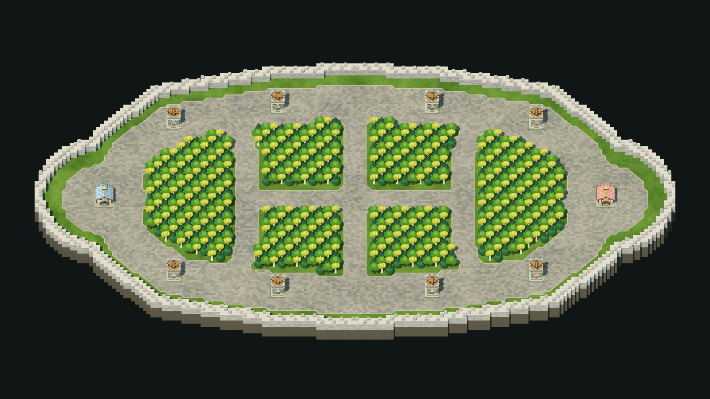

# 건설 구역과 초기 숲 배치

첨부한 설계의 회색 도로, 초록색 건설 부지, 노란색 초기 나무 구역을 실제 맵에 반영했습니다. 좌우 본진과 상·하단 공격로는 유지하고, 중앙 십자 도로 및 좌우 연결로로 내부를 여섯 구역으로 나눕니다.



## 구역 규칙

| 맵 데이터 | 표시 | 이동 및 건설 |
| --- | --- | --- |
| `R` | 회색 중세 석재 도로, 밝은 돌 테두리 | 이동 가능, 새 건물 건설 불가 |
| `.` | 초록색 풀밭 | 장애물이 없으면 이동·건설 가능 |
| `T` | 초기 나무의 시작 칸 | 나무의 2×2 영역을 차단하며, 벌목 완료 후 풀밭으로 사용 |
| `W` | 외곽 석벽 | 이동·시야·건설 차단, 채집 불가 |
| `#` | 맵 바깥 | 이동·건설 불가 |

좌우 본진 안쪽 2곳과 중앙 위·아래 4곳의 내부 숲 구역을 도로 경계까지 나무로 빽빽하게 채웁니다. 외곽은 두 칸 두께의 낮은 석벽으로 둘러쌉니다. 노란색은 설계에서 나무 배치를 지정한 색이며 게임에서는 실제 나무로 표시합니다. 총 740그루, 도로 5,064칸, 외곽 벽 976칸, 시작부터 비어 있는 풀밭 1,540칸입니다. 내부 숲에는 2×2 나무 점유 영역이 들어갈 수 있는 빈자리를 모두 채우고, 도로와 겹치는 경계의 자투리 칸은 남깁니다. 숲 부지는 벌목하면서 확보할 수 있습니다. 기존 시작 건물의 점유 영역은 건설 판정에서 추가로 제외합니다.

외곽 건설 부지는 라인 바깥에 약 3칸 폭으로 좁혀 남겼습니다. 위·아래 성벽을 안으로 당겨 실제 지형의 세로 길이는 88→82칸, 좌우 길이는 166칸으로 유지합니다. 중앙 숲·도로·포탑 위치는 그대로입니다. 나무와 도로, 빈 부지는 X=0 및 Z=0을 기준으로 대칭입니다. 나무 한 그루는 시작 칸에서 +X/+Z 방향의 2×2칸을 차지하며 모델 크기는 그대로입니다. 나무 점유 영역이 도로와 겹치는 맵은 클라이언트와 서버 모두 거부합니다.

건물 중심만이 아니라 **건물 전체 면적**이 풀밭 안에 있어야 합니다. 도로에 걸친 배치는 클라이언트에서 빨간 미리보기와 사유로 표시하고, 서버도 BUILD 요청과 현장 도착 시 다시 검사합니다. 도로는 시야나 이동을 막지 않습니다. 벌목 및 건물 파괴로 도로의 건설 금지가 해제되지 않습니다. 시작 회관·요새는 지정된 기존 자리에서 생성합니다.

미니맵도 도로는 회색, 빈 부지는 초록색, 나무는 진한 초록색으로 표시합니다. 벌목 후 미니맵 색상과 건설 가능 여부가 함께 바뀝니다.

## 열기

- `game/Main.tscn`: 실제 게임. JSON에서 지형·나무를 생성하고 서버와 동기화합니다.
- `previews/Forest.tscn`: 서버 없이 지형·초기 나무·시작 건물을 확인합니다. Godot에서 열고 F6으로 실행합니다.
- `previews/Arena.tscn`: 나무가 없는 지형 미리보기입니다.
- `maps/SymmetricArena.tscn`: 편집용으로 생성된 지형 캐시입니다.

휠로 확대/축소, W/S·Q/D·방향키 또는 마우스 가운데 버튼 드래그로 이동, Home으로 전체 보기로 돌아갑니다.

## 좌표와 지면

좌우는 X, 위아래는 Z, 높이는 Y입니다. 본진 중심은 (-65, 0, 0), (65, 0, 0)입니다. `maps/test.json` 원점은 (-84, -46), 한 칸은 1×1, 전체 배열은 168×92칸입니다. 상·하단 공격로의 설계 폭은 12(기존 8), 내부 도로는 6(기존 4)입니다. 포탑 8개는 공격로 중심선의 (±47, ±24), (±20, ±29)에 배치합니다. 외곽 통과 지점은 기존 포탑의 시야 11 및 벽면 기준 사거리 7 안에 들어오게 배치하며 공격 능력치는 바꾸지 않습니다. 줄인 부분은 JSON에서 맵 밖으로 처리해 원점·배열 크기·기존 나무 ID를 유지합니다.

지면은 모두 Y=0이며 외곽 절벽은 Y=-4.5까지 내려갑니다. 석벽 본체는 높이 2.6, 상단 돌출부는 3.25이며 실제 충돌과 서버 격자 차단을 함께 적용합니다. `TerrainBuilder.gd`의 지면 메시 및 충돌은 JSON 지면 칸을 따릅니다. `LayoutGuides`는 편집용 본진 Marker3D와 공격로 Path3D를 제공합니다. 미니언 실제 경유지는 JSON의 `lanes`를 사용합니다.

`Ground.gdshader`는 JSON의 `R` 칸으로 만든 텍스처를 읽어 도로를 그립니다. 건설 금지 데이터와 별개인 가상의 도로를 그리지 않습니다. 도로 경계에는 얇은 석재 테두리, 내부에는 엇갈려 놓인 회색 포석과 이음새·이끼를 표현합니다. 풀과 돌의 작은 무늬는 축소할 때 약해집니다. 표면 요철은 조명에만 적용하며 실제 높이와 충돌은 평평합니다.

## 수정 및 재생성

직접 편집하려면 양쪽 프로젝트의 `maps/test.json`을 동일하게 수정합니다. `R`은 도로, `.`은 풀밭, `T`는 나무 시작 칸, `W`는 영구 석벽입니다. 행은 작은 Z부터, 열은 작은 X부터 시작합니다. 나무와 달리 도로는 전체 영역에 `R`을 적습니다.

자동 배치는 `maps/TerrainBuilder.gd`의 `TOP_LANE`, `TRAIL_SEGMENTS`, `is_road`, `is_initial_forest`에서 조절합니다. 외곽은 `is_arena_land`, `OUTER_BUILD_WIDTH=3`, `WALL_THICKNESS=2`, `BASE_OUTER_RADIUS=18`로 조절합니다. 이후 프로젝트 루트에서 실행합니다.

```text
Godot --headless --path . --script tools/plant_forest.gd
Godot --headless --path . --script tools/build_arena.gd
```

`Godot`에는 설치된 Godot .NET 실행 파일 경로를 사용합니다. 첫 명령은 고정 좌표를 기준으로 외곽선·도로·벽·나무를 다시 작성하고 포탑을 라인 중앙에 맞추므로 수동 배치를 대체합니다. 반복 실행해도 맵이 더 줄어들지 않습니다. 두 번째 명령은 `maps/SymmetricArena.tscn`과 `maps/resources/`의 지형 캐시를 갱신합니다. 실제 게임은 매번 JSON에서 생성합니다.

완성한 JSON을 Go 서버의 `maps/test.json`에도 **바이트 그대로 복사**하고 서버를 재시작합니다. 이번 변경에서는 양쪽 맵 복사와 서버 실행 파일 빌드까지 완료했습니다. 이후 파일 복사는 자동화되어 있지 않습니다. 자세한 내용은 [맵 동기화](map-sync.md)를 참고하세요.

## 검증

- C# 빌드: 경고 0, 오류 0.
- `tests/MapZonesChecks.tscn`: 도로 건설 금지, 일부만 걸치는 배치, 경계에 붙인 건설, 벌목 후 건설, 미니맵 구분, 재접속.
- `tests/MapSyncChecks.tscn`, `tests/BuildingPlacementChecks.tscn`: 기존 동기화·건설 입력 검증 통과.
- `tests/check_arena.gd`: 평면·대칭, 벽 충돌을 포함한 격자 61,824곳과 공격로 402곳, 포탑의 라인 중앙 배치 검사 통과.
- Go: `TestMapConstructionZones`, `TestBuildRejectsRoadAtCommandAndArrival`, `TestArenaRoadSymmetryAndGroves`, `TestForestFootprintSymmetry`, `TestTwoByTwoTrees`, `TestMapSync` 통과.
- `TestOuterPerimeterCannotBypassTowers`: 일꾼·기사 크기로 포탑 8개의 외측 통과 위치 3,856곳이 실제 서버 판정에서 보이고 공격 가능한지 확인. 벽면부터 유닛 가장자리까지의 최대 거리는 6.1칸으로 사거리 7 이내이며, 외곽의 3×3 건설 자리도 유지됩니다.
- 실제 Forward+ 렌더링에서 전체 맵과 확대 화면 확인.

전체 `go test ./...`는 통과 상태가 아닙니다. 기존 건물 크기·포탑 건설 허용 여부에 대한 오래된 기대값과 이동·밀어내기 검사에서 실패가 있습니다. 변경 전 서버 ZIP의 소스 53개가 현재의 미수정 소스와 일치함을 확인한 뒤 별도 복사본에서 원본 테스트를 실행했으며, 기존 실패 8개를 재현했습니다. 이번 맵 작업에서는 관련 없는 전투·이동 동작이나 그 기대값을 수정하지 않았습니다.
