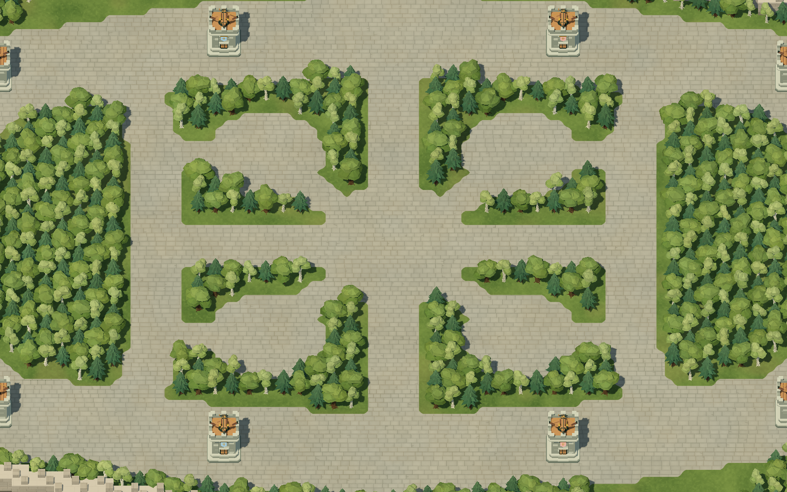
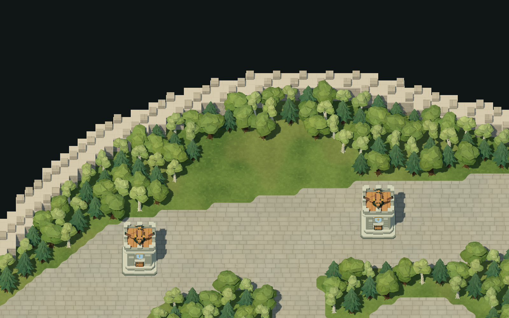

# 중앙·정글과 성곽 확장 부지

상·하단 라인 폭을 유지하면서 기존 숲 안쪽을 비워 중앙 이벤트 광장과 네 곳의 정글 공터를 만듭니다. 중앙과 정글은 기존 회색 도로 타일을 사용합니다. 1팀 상단의 두 요새 사이와 2팀 하단의 두 요새 사이에는 외곽이 완만하게 부풀어 오른 확장 부지를 두어 RTS 지휘관이 건물을 지을 수 있게 합니다. 본진·포탑·기존 공격로와 내부 숲의 월드 좌표를 유지합니다. 두 멀티를 포함한 전체 맵은 원점 기준 180도 회전 대칭이며, 기존 중앙 지형은 X=0 및 Z=0 반사 대칭을 유지합니다.


## 중앙과 정글

| 구역 | 중심 (X, Z) | 크기 | 표시 |
| --- | --- | --- | --- |
| 이벤트 광장 | (0, 0) | 반경 9의 원형 | 기존 회색 석재 도로 |
| 정글 공터 4곳 | (±15, ±13) | X 반경 7, Z 반경 6의 타원 | 기존 회색 석재 도로 |
| 정글 진입로 | 공터 중심에서 (±6, ±5), (±28, ±13)까지 | 폭 4 | 기존 회색 석재 도로 |

각 정글 공터에는 중앙 광장으로 향하는 입구와 바깥쪽 연결로로 향하는 입구가 하나씩 있습니다. 좌표의 부호는 해당 공터의 사분면을 따릅니다. 공터는 가로 14·세로 12칸 규모여서 몬스터 주변에서 움직일 공간을 확보하고, 입구 두 곳으로 진입과 이탈 동선을 나눕니다. 공터 사이와 라인 가장자리에는 숲을 남깁니다.



현재는 지형과 스폰 기준점만 준비되어 있습니다. 실제 이벤트 진행, 몬스터 생성·전투·보상 로직은 아직 추가하지 않았습니다.

## 성곽 확장 부지

1팀 멀티는 상단 요새 두 곳 사이의 바깥쪽에, 2팀 멀티는 이를 180도 회전한 하단 위치에 있습니다. 기존 중앙 상·하단 멀티는 제거하고 해당 외벽을 원래 윤곽으로 복원했습니다. 따로 덧붙인 돌출부 대신 라인 바깥의 외곽 띠 자체가 멀티 쪽으로 넓어집니다. 멀티 중심 X에서 좌우 41.5칸에 걸쳐 코사인 곡선으로 최대 10칸까지 부풀고, 양 끝은 기울기 0으로 원래 외곽에 이어져 벽이 하나의 곡선으로 이어집니다(`EXPANSION_SWELL_*`). 더한 면적은 이전 성곽 돌출부와 같은 멀티당 428칸입니다. 곡선 외곽은 실제 이동·시야·충돌과 같은 1칸 격자를 따라 생성합니다.

멀티의 건설 공터는 라인 도로 가장자리에 바닥을 붙인 돔 모양 잔디밭입니다(`EXPANSION_BAY_*`). 바닥 전체가 라인과 이어져 1팀 기준 X 약 -44~-24 폭으로 열려 있고, 위쪽은 도로 가장자리에서 최대 7.5칸 높이까지 부드러운 곡선으로 숲과 만납니다. 모양은 `(|라인 방향 거리| / 9.5)^2.5 + (도로 가장자리에서의 높이 / 7.5)^2.5 ≤ 1`이며, 중심은 멀티 X에서 맵 중앙 쪽으로 0.5칸 옮겼습니다. 별도 접근로 없이 드나들고 견제할 수 있습니다. 잔디는 멀티마다 약 125칸으로 저장소(3×3)를 여유 있게 지을 수 있고, 양옆과 뒤는 벽까지 숲입니다. 사이트 표시 위치는 1팀 (-34, -37), 2팀 (34, 37)입니다. 숲 속에서 완전한 나무 한 그루가 들어가지 않는 1칸 자투리는 잔디로 남겨 숲 바닥처럼 보이게 합니다. 나무 사이라 건물은 들어가지 않습니다. 벌목하면 기존 규칙대로 나무가 차지하던 땅을 건설에 사용할 수 있습니다. 새 회관 건설 기능은 추가하지 않았습니다.

## 라인 바깥 숲과 본진 잔디

라인 바깥쪽은 벽까지 숲으로 채웁니다(`is_outer_forest()`). 예외는 각 회관 중심에서 반경 18 안의 둥근 잔디(`BASE_MEADOW_RADIUS`)와 멀티 잔디밭입니다. 본진 잔디는 팀마다 빈 칸 209칸으로, 1칸 통로를 두고 3×3 건물 약 9채를 지을 수 있어 처음부터 합숙소·병영·대장간 등을 짓는 데 충분합니다. 회관 뒤쪽과 옆이라 견제하려면 공격하는 회관 앞을 지나야 합니다.

바깥 숲은 벽에 가까운 자리부터 2×2 나무를 심어 남는 틈이 벽 뒤가 아니라 라인 쪽에 생기게 합니다. 그래서 나무 뒤로 요새 시야를 피해 지나가는 샛길이 생기지 않습니다(라인에서 7m 넘게 떨어진 걸을 수 있는 틈은 최대 5칸짜리 조각이며 서로 이어지지 않습니다). 두 팀이 같도록 180도 회전 위치에 짝으로 심습니다. 안쪽 숲은 기존 짝수 격자를 유지해 나무 좌표와 ID가 바뀌지 않습니다.



## 구역 규칙

| 맵 데이터 | 표시 | 이동 및 건설 |
| --- | --- | --- |
| `R` | 회색 석재 도로·이벤트 광장·정글 공터·진입로 | 이동 가능, 새 건물 건설 불가 |
| `.` | 초록색 풀밭 | 장애물이 없으면 이동·건설 가능 |
| `T` | 초기 나무의 시작 칸 | 나무의 2×2 영역을 차단하며, 벌목 완료 후 풀밭으로 사용 |
| `W` | 외곽 석벽 | 이동·시야·건설 차단, 채집 불가 |
| `#` | 맵 바깥 | 이동·건설 불가 |

초기 배치는 나무 794그루, `R` 5,800칸, 외곽 벽 `W` 1,032칸, 나무 점유를 제외한 빈 풀밭 1,388칸입니다(숲 속 1칸 자투리 포함). 내부 숲 532그루는 기존 좌표와 ID를 유지하며, 라인 바깥과 두 멀티에 262그루를 배치합니다. 시작 건물의 점유는 별도로 계산합니다. 나무 한 그루는 시작 칸에서 +X/+Z 방향의 2×2칸을 차지합니다. 나무 점유 영역이 도로와 겹치는 맵은 클라이언트와 서버 모두 거부합니다.

건물은 **전체 면적**이 건설 가능한 풀밭 안에 들어가야 합니다. 도로·광장·정글 공터에 걸친 배치는 클라이언트에서 빨간 미리보기와 사유로 표시하고, 서버도 BUILD 요청과 현장 도착 시 다시 검사합니다. `R`은 이동·시야를 막지 않으며 벌목이나 건물 파괴로 건설 금지가 해제되지 않습니다. 기존 시작 건물의 점유 영역은 추가로 건설에서 제외합니다.

미니맵은 모든 `R` 칸을 동일한 회색으로, 확장 부지를 포함한 빈 풀밭을 초록색으로, 나무를 진한 초록색으로 표시합니다. 벌목 후에는 나무 영역의 미니맵 표시와 건설 가능 여부가 함께 바뀝니다.

## 열기

- `game/Main.tscn`: 실제 게임. JSON에서 지형·나무를 생성하고 서버와 동기화합니다.
- `previews/Forest.tscn`: 서버 없이 지형·초기 나무·시작 건물을 확인합니다. Godot에서 열고 F6으로 실행합니다.
- `previews/Arena.tscn`: 나무가 없는 지형 미리보기입니다.
- `maps/SymmetricArena.tscn`: 편집용으로 생성된 지형 캐시입니다.

미리보기에서는 휠로 확대/축소하고 W/S·Q/D·방향키 또는 마우스 가운데 버튼 드래그로 이동합니다. Home은 전체 보기로 돌아갑니다. 카메라의 전체 보기 배율과 이동 범위는 생성한 지형의 원점·크기를 읽어 상·하단 확장 부지를 포함합니다.

## 좌표와 데이터

좌우는 X, 위아래는 Z, 높이는 Y입니다. 본진 중심은 (-65, 0, 0), (65, 0, 0)입니다. `maps/test.json` 원점은 (-84, -64), 한 칸은 1×1, 전체 배열은 168×128칸입니다. 확장 부지를 포함한 실제 지형의 외곽 크기는 166×96칸입니다. 상·하단 공격로 폭은 12, 내부 도로 폭은 6입니다. 포탑 8개는 (±47, ±24), (±20, ±29)에 있습니다. 1팀 멀티의 입구는 상단 (-47, -24)와 (-20, -29) 사이에, 2팀 멀티의 입구는 하단 (47, 24)와 (20, 29) 사이에 연결됩니다. 확장 부지 이외에는 라인 바깥 약 3칸 폭의 숲(본진 잔디 제외)과 두 칸 두께의 석벽이 이어집니다.

`rows`가 이동·건설·나무 배치 판정의 기준입니다. `activityAreas`는 이벤트·정글 구역의 의미와 향후 스폰 기준점을 지정하는 선택적 메타데이터이며 색상에는 관여하지 않습니다.

| 필드 | 의미 |
| --- | --- |
| `id` | `center_event`, `jungle_nw`, `jungle_ne`, `jungle_sw`, `jungle_se` 등 구역 식별자 |
| `kind` | `event` 또는 `jungle` |
| `center` | 구역 중심의 월드 좌표 `[X, Z]` |
| `radii` | 타원의 X·Z 반경 |
| `entrances` | 중심과 연결할 입구의 월드 좌표 목록 |
| `entranceWidth` | 연결 통로의 전체 폭; 입구가 없는 이벤트 광장은 0 |

타원 내부와 중심에서 각 입구로 이어지는 선분 주변을 구역으로 취급합니다. 맵 생성 도구는 이 범위에 도로 칸을 배치하지만, 지형과 미니맵은 저장된 `rows`의 모든 `R` 칸을 같은 타일과 색으로 표시합니다. 메타데이터만 추가해도 숲이 제거되는 것은 아니므로 `rows`를 함께 생성해야 합니다.

선택적 `expansionSites` 배열은 `id`, 월드 좌표 `center`, 공터 크기 `buildSize`로 확장 부지를 설명합니다. 현재 항목은 `team1_expansion`과 `team2_expansion`이며 잔디밭 중심은 각각 [-34, -37], [34, 37], `buildSize`는 보장하는 건물 크기(저장소) [3, 3]입니다. 실제 건설 가능 여부는 이 메타데이터와 별도로 `rows`와 건물 점유 영역을 따릅니다.

`TerrainBuilder.gd`는 JSON 격자를 따라 평평한 Y=0 지면과 충돌을 생성합니다. `Ground.gdshader`는 도로 마스크로 회색 포석과 풀밭을 표현합니다. 바닥 무늬는 실제 높이나 이동 판정을 바꾸지 않습니다. 외곽 절벽은 Y=-4.5, 석벽 본체 높이는 2.6, 상단 돌출부는 3.25입니다. 확장 부지도 같은 벽과 지면으로 이어집니다.

### 외형 바리에이션

고정 시드로 생성한 나무 메시와 위치 기반 셰이더를 사용하므로 모든 클라이언트에서 같은 모습이며 판정과는 무관합니다.

| 대상 | 파일 | 바리에이션 (조절 값) |
| --- | --- | --- |
| 돌길 | `maps/materials/Ground.gdshader` | 폭·높이가 조금씩 다른 포석, 둥글게 닳은 모서리와 얕은 줄눈. 먼지는 여러 돌에 걸쳐 이어지고 틈에 쌓입니다(`dusty_ratio`는 농도, 기본 0.18). 일부 돌의 가장자리에서 짧은 실금이 시작합니다(`cracked_ratio`, 0.065). 색차는 작게 유지합니다. |
| 잔디 | 같은 파일 | 넓게 이어지는 녹색·마른 풀 얼룩(`grass_dry`), 가까이서만 보이는 풀잎과 클로버. 도로 가장자리의 밝은 테두리를 줄였습니다. |
| 벽 | `maps/materials/Wall.gdshader` | 따뜻한 회색 석회암, 닳은 모서리와 밝은 갓돌. 지면의 습기·이끼가 여러 칸에 이어집니다(`mossy_ratio`, 0.45). 작은 거미줄(`cobweb_ratio`, 0.06), 가는 균열(`cracked_ratio`, 0.055), 옅은 빗물 자국을 더했습니다. |
| 나무 | `resources/trees/SculptedTree.gd`, `Foliage.gdshader` | 참나무는 넓고 비대칭인 각진 수관, 자작은 갈라진 밝은 줄기와 가벼운 수관, 침엽수는 톱니형 가지층. 수종별 4개씩 총 12개 메시를 공유합니다. `ResourceManager`가 자원 ID로 회전(0~360°)과 크기(0.9~1.1배)를 정하고, 회전으로 형태·밝기·색온도를 선택합니다. |

셰이더 코드에 숫자로 적은 색은 선형(linear) 값이라 같은 숫자의 `source_color` 유니폼보다 밝게 보입니다. 새 색은 유니폼으로 추가하는 것을 권장합니다. 나무의 sRGB 팔레트는 메시의 정점 색으로 저장할 때 `srgb_to_linear()`로 한 번 변환합니다. 나무 하나는 MeshInstance 하나·재질 표면 둘이며 기존 선택·자원·충돌 노드는 유지합니다.

`previews/Forest.tscn`을 `-- --capture-wall`로 실행하면 1팀 본진 옆 북쪽 벽을 가까이 찍어 `images/wall-closeup.png`에 저장합니다. `previews/Trees.tscn -- --capture`는 세 수종을 나란히 찍어 `images/trees-preview.png`에 저장합니다. 수종 미리보기는 1600×1000 해상도를 권장합니다.

`LayoutGuides`에는 본진 Marker3D, 공격로 Path3D와 각 활동 구역·확장 부지의 `id`를 이름으로 하는 Marker3D가 있습니다. 활동 구역 마커는 중심 위치와 `kind`·`radii` 메타데이터를 제공하는 향후 스폰용 기준점입니다. 확장 부지 마커에는 `kind=expansion`이 지정됩니다. 미니언의 실제 경유지는 JSON의 `lanes`를 사용합니다.

## 수정 및 재생성

자동 배치 기준은 `maps/TerrainBuilder.gd`에 있습니다. 광장과 정글은 `EVENT_RADIUS`, `JUNGLE_CENTER`, `JUNGLE_RADII`, `JUNGLE_ENTRANCE_WIDTH`, `activity_areas()`에서 조절합니다. 확장 부지는 `EXPANSION_*`, `is_expansion_land()`, `is_expansion_clearing()`, `expansion_sites()`, 라인 바깥 숲과 본진 잔디는 `is_outer_forest()`, `BASE_MEADOW_RADIUS`에서 조절합니다. 기존 도로는 `TOP_LANE`, `TRAIL_SEGMENTS`, `is_road()`, 숲 경계는 `is_initial_forest()`, 외곽은 `is_arena_land()`에서 조절합니다. 전체 배열의 원점과 크기는 `MAP_ORIGIN`, `MAP_SIZE`로 고정합니다.

클라이언트 프로젝트 루트에서 다음을 실행합니다. `Godot`은 설치된 Godot .NET 실행 파일 경로로 바꿉니다.

```text
Godot --headless --path . --script tools/plant_forest.gd
Godot --headless --path . --script tools/build_arena.gd
```

첫 명령은 고정 좌표를 기준으로 `rows`·`activityAreas`·`expansionSites`·나무를 다시 작성하고 포탑을 라인 중앙에 맞추므로 수동 배치를 대체합니다. 두 번째 명령은 `maps/SymmetricArena.tscn`과 `maps/resources/`의 지형 캐시를 갱신합니다. 실제 게임은 JSON에서 지형을 생성합니다. 이번 멀티 이전은 원점과 배열 크기를 유지하므로 기존 내부 나무의 좌표와 ID도 유지합니다. 다만 멀티의 나무 배치와 맵 해시가 바뀌므로 이전 실행의 변경 기록을 새 맵에 재사용하면 안 됩니다.

완성한 JSON을 Go 서버의 `maps/test.json`에도 **바이트 그대로 복사**하고 서버를 재시작합니다. 현재 배치의 캐시 재생성과 서버 JSON 복사는 완료되어 있습니다. 맵 데이터 변경만으로 서버 실행 파일을 다시 빌드할 필요는 없습니다. 자세한 실행 방법은 [맵 동기화](map-sync.md)를 참고하세요.

## 관련 검증

- 클라이언트: 라인 바깥 숲·곡선 멀티로 바꾼 뒤 C# 빌드와 MapSyncChecks·MapZonesChecks·FogSyncChecks·check_arena가 통과했습니다. 양쪽 멀티의 저장소 배치, 옆·뒤 나무 차단, 회전 대칭·지형 충돌을 확인했습니다. 실행기 사용법과 검증 범위는 [테스트 안내](../tests/README.md)를 참고하세요.
- 서버: `TestArenaBastionExpansionSites`, `TestArenaLaneEdgesAreForest`, `TestArenaObjectiveAndJungleAccess`, `TestMapSync`, `TestFindPathTestMap`이 통과했습니다. 멀티 잔디밭의 넓은 입구·저장소 배치와 일꾼의 실제 저장소 완공, 본진 잔디·멀티 밖 라인 바깥에 저장소 크기 빈 땅이 없는지, 이전 돌출부 끝이 맵 밖인지, 중앙·정글의 전투 공간·입구 통과·건설 금지, 맵 동기화와 경로 탐색을 확인했습니다. 봇 자동 대전 20판에서 3분 안에 병영·병력을 만들지 못한 판은 없었습니다.
- 화면: 현재 맵과 외형 바리에이션을 실제 GPU 렌더링으로 다시 찍었습니다(`images/forest-preview.png`, `terrain-closeup.png`, `expansion-preview.png`, `jungle-preview.png`, `wall-closeup.png`, `trees-preview.png`). 셰이더 오류는 없었습니다. 이번 외형 개선에서 맵 JSON 해시는 유지했고, 편집용 지형 캐시를 갱신했습니다. 나무 12종의 메시 생성·표면·법선도 확인했습니다.
