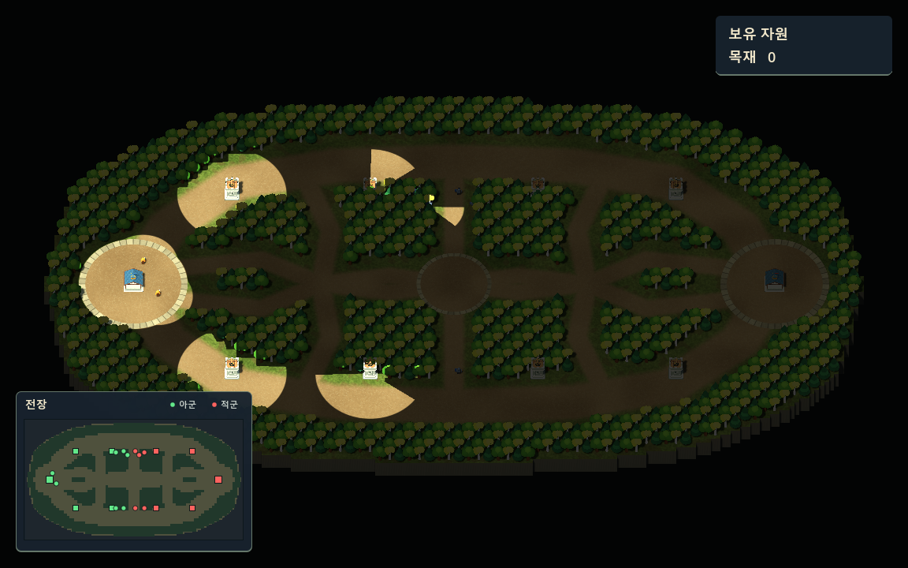

# 미니맵

`game/Main.tscn`의 `SelectionUI/Minimap`이 화면 좌측 하단에 표시됩니다. 크기는 300×204이며 왼쪽과 아래쪽 여백은 20입니다. 맵의 가로세로 비율을 유지합니다.

- 아군 유닛과 미니언: 작은 초록 원.
- 아군 건물: 초록 사각형. 회관은 포탑보다 조금 크게 표시합니다.
- 적 유닛과 건물: 같은 모양의 빨간 표식.
- 땅·숲·벽: 서로 다른 낮은 채도의 색상.

진영은 `WELCOME`의 팀 번호로 구분합니다. 유닛 표식은 `UnitManager.LiveUnits`, 건물은 `BuildingManager.LiveBuildings`를 사용하므로 시야 이탈(`HIDE`), 사망·파괴(`REMOVE`), 재접속 시 오래된 표식이 남지 않습니다. 접속 종료나 동기화 실패 때도 팀과 표식을 초기화합니다. 적 건물은 현재 서버가 공개한 목록대로 표시됩니다.

`MapWorld.CreateMinimapTerrainImage()`가 현재 지형을 칸당 한 픽셀로 만듭니다. 나무의 전체 점유 영역과 벌목 후 빈 땅을 반영하고, `OcclusionVersion`이 바뀔 때만 텍스처를 갱신합니다. `Minimap.cs`는 서버 메시지로 상태가 바뀌거나 UI 크기가 바뀔 때 다시 그립니다. 표식마다 별도 노드를 만들지 않습니다.

현재는 표시용 UI입니다. 패널 위의 클릭과 휠은 뒤쪽 전장으로 전달되지 않습니다. 전장에서 시작한 카메라 중간 버튼 드래그는 미니맵 위에서 버튼을 놓아도 끝납니다.

검증: `dotnet build --no-restore`, `tests/MinimapChecks.tscn`. 정상 그래픽 렌더러로 실행하고 `-- --minimap-capture`를 추가하면 실제 표식 색상과 소멸을 검사한 뒤 `.godot/minimap-preview.png`를 저장합니다.

