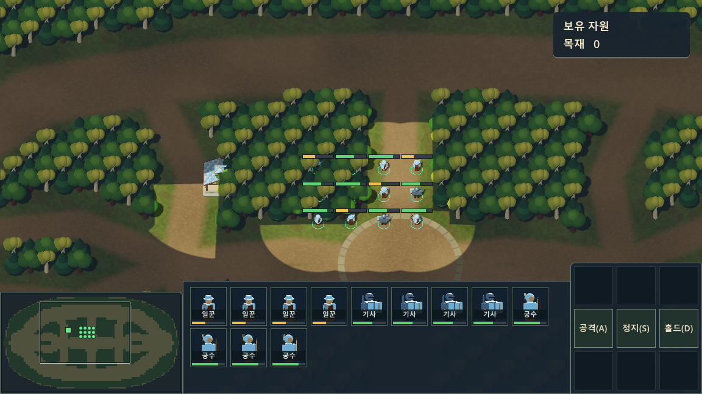

# 부대 지정·선택 확장·미니맵 조작

모두 클라이언트 기능입니다. 서버 메시지 형식을 추가하지 않으며 이동에는 기존 `MOVE x z 유닛ID...`를 사용합니다. 초상화도 계속 미리 저장한 PNG를 표시합니다.

## 부대 지정

| 입력 | 동작 |
| --- | --- |
| Ctrl+1~9 | 현재 선택한 내 유닛을 해당 번호에 저장/덮어쓰기 |
| 1~9 | 저장된 부대 선택 |
| 같은 숫자를 빠르게 두 번 | 부대 선택 후 그 중심으로 카메라 이동 |

두 번 누르기는 350ms 이내의 별도 키 입력입니다. 키를 누르고 있을 때의 자동 반복은 무시하고 카메라 각도와 줌은 유지합니다. 빈 번호를 불러와도 현재 선택은 유지합니다. 선택이 없는 상태에서 저장하면 해당 번호가 비워집니다. 건물은 부대에 저장하지 않습니다.

부대는 최대 64개의 내 유닛 ID만 저장합니다. 사망·HIDE·소유권 상실 시 해당 ID를 제거하며 같은 ID로 다시 등장해도 자동으로 다시 들어오지 않습니다. 플레이어/진영 변경, 맵 재동기화, 접속 종료 시 저장 부대를 초기화합니다.

## 전장 선택

| 입력 | 동작 |
| --- | --- |
| 좌클릭 / 드래그 | 기존 선택을 교체 |
| Shift+좌클릭 | 해당 유닛을 추가하거나, 이미 선택했다면 제외 |
| Shift+드래그 | 박스 안에 새 유닛이 있으면 추가. 전부 선택된 유닛이면 박스 안 유닛을 제외 |
| 더블클릭 | 화면 안의 같은 종류인 내 유닛을 선택 |
| Shift+더블클릭 | 화면 안의 같은 종류인 내 유닛을 기존 선택에 추가 |

Shift를 누른 상태에서 빈 땅·건물·다른 소유자의 유닛을 클릭하면 기존 유닛 선택을 유지합니다. 드래그는 누르기 시작한 시점의 Shift 상태를 사용합니다. 선택은 기존과 동일하게 최대 64개이며 적·다른 플레이어·자동 미니언은 포함하지 않습니다. 초상화에서 사용하는 기존 Shift/Ctrl 조작은 그대로 유지합니다.

## 미니맵

| 입력/표시 | 동작 |
| --- | --- |
| 좌클릭 | 해당 지점으로 카메라 이동 |
| 좌클릭 드래그 | 누른 상태로 카메라 위치 조정 |
| 우클릭 | 선택한 부대는 이동, 아군 회관·병영은 이동 랠리 지정 |
| 밝은 사각형 | 현재 카메라의 지면 범위. 카메라 이동·줌·창 크기에 맞춰 변경 |

미니맵 조작은 현재 선택을 유지하고 A키 공격 대상 지정 모드를 종료합니다. 우클릭은 적 표식 위에서도 일반 이동으로 처리합니다. 테두리 여백의 클릭과 휠은 전장으로 전달하지 않습니다. 드래그 중 미니맵 밖으로 나가면 지도의 가장자리까지 이동하며, 밖에서 버튼을 놓거나 Esc·우클릭·창 포커스 해제로 드래그를 종료합니다. 카메라 이동에는 기존 맵 경계 제한을 적용합니다.

선택 변경, 부대 저장/호출, 미니맵 이동 명령은 `PlayerInput`의 같은 입력 큐를 사용합니다. 같은 물리 프레임에 선택하고 명령해도 순서가 보존됩니다. 맵 재동기화·접속 종료 시 대기 중인 입력도 초기화하고, 실제 전송은 기존 `Main.SendCommand`의 동기화 검사와 `UnitManager`의 소유권 검사를 따릅니다.

## 검증

```text
dotnet build --no-restore
Godot --headless --path . --resolution 1152x648 res://tests/RtsControlChecks.tscn
Godot --headless --path . res://tests/UnitSceneChecks.tscn
Godot --headless --path . res://tests/SelectionDetailsChecks.tscn
Godot --headless --path . res://tests/MinimapChecks.tscn
Godot --headless --path . res://tests/CommandPanelChecks.tscn
```

`Godot`은 설치된 Godot .NET 실행 파일로 바꿉니다. 테스트는 실제 서버에 연결하지 않고 서버 스냅샷을 주입하며, 실제 Viewport 마우스·키 입력과 메모리에 기록된 네트워크 출력을 검증합니다. 그래픽 렌더러에서 `RtsControlChecks.tscn` 실행 시 `-- --rts-controls-capture`를 덧붙이면 `.godot/rts-controls.png`를 저장합니다.


