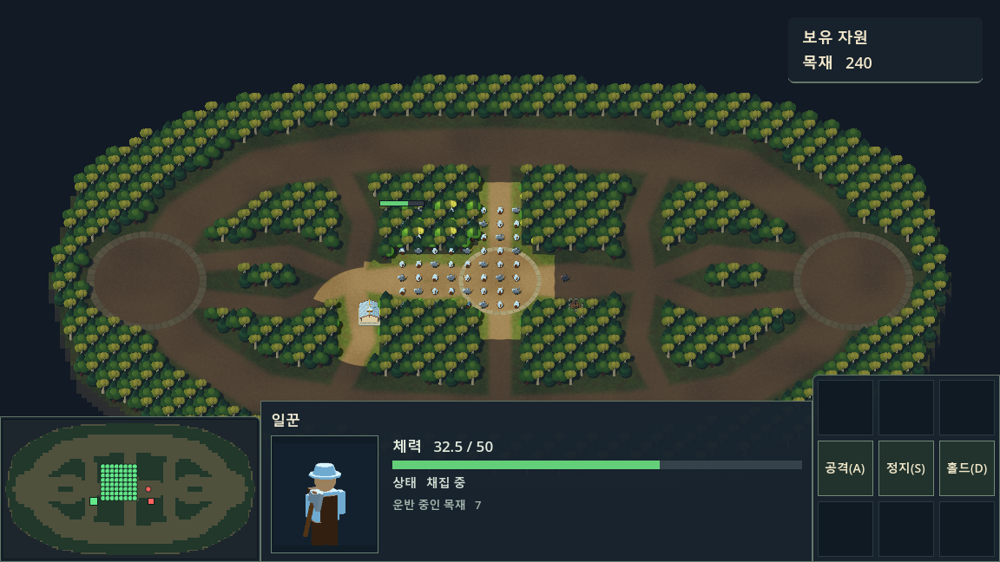
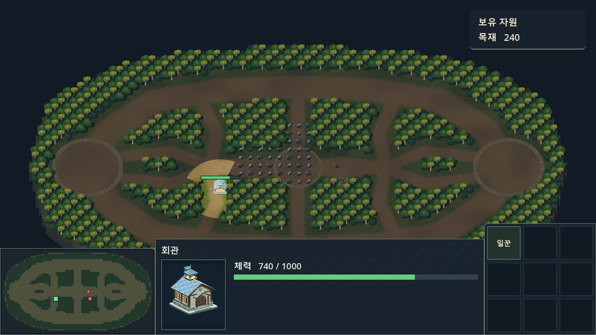
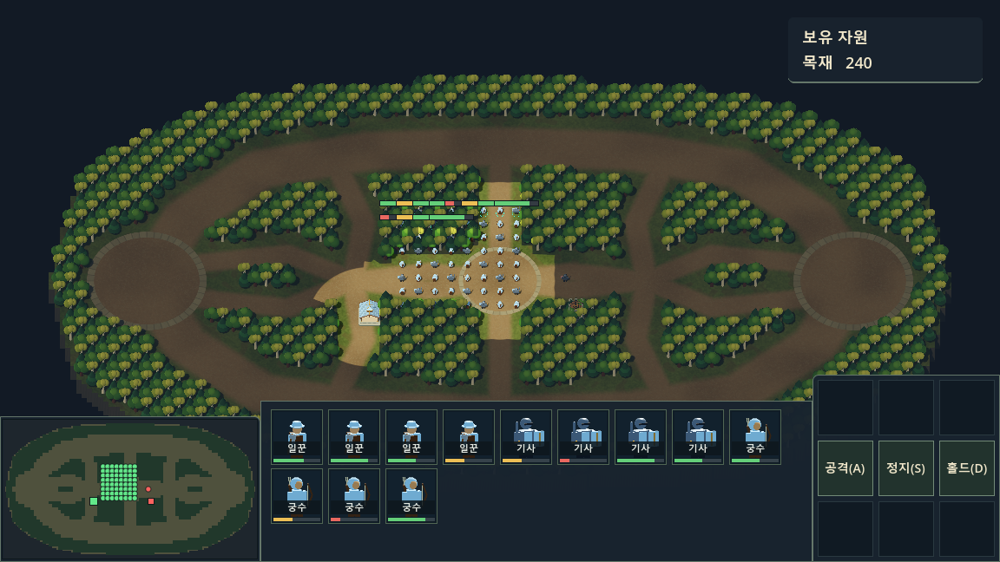
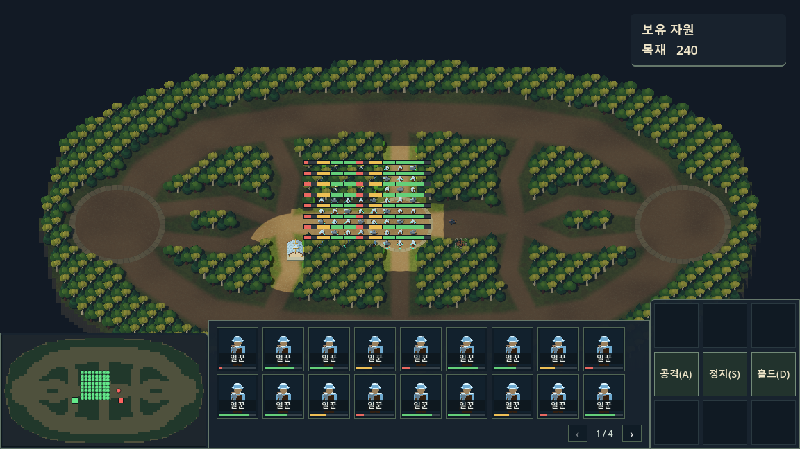
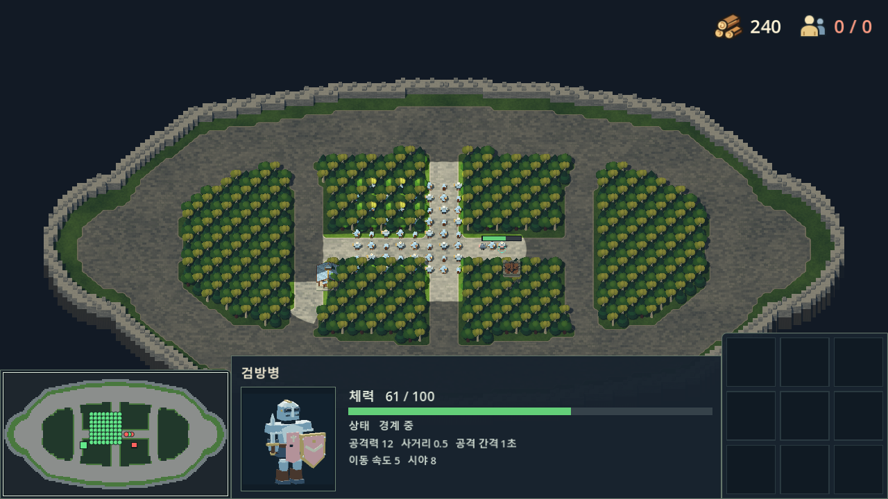
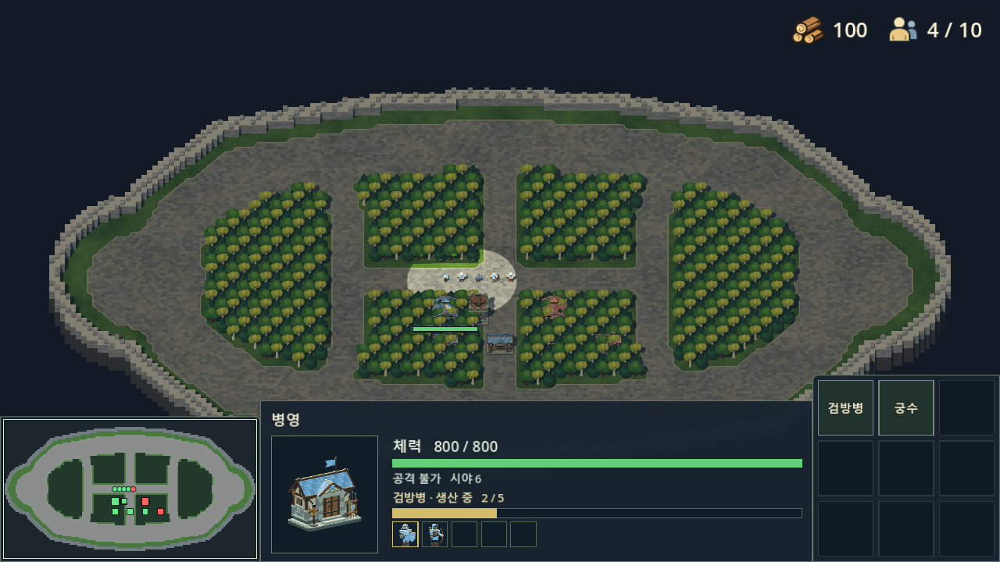

# 선택 상세정보 창

하단의 미니맵과 명령 패널 사이에 `SelectionUI/SelectionDetails`를 표시합니다. 높이는 186px이고, 너비는 창 크기에 따라 늘어납니다. 다중 선택의 상단 집계와 하단 조작 안내를 없애 확보한 약 60px 중 절반인 30px만큼 기존 216px 높이를 줄였습니다. 아래쪽 위치를 유지해 패널 위로 전장이 더 보입니다.

- **유닛 1개:** 시야에 보이는 내 유닛·다른 플레이어의 유닛·적·미니언을 클릭해 초상화, 이름, 현재/최대 체력, 행동 상태, 공격력, 사거리, 공격 간격, 이동 속도, 시야를 확인합니다. 일꾼은 운반 중인 목재도 표시합니다. 다른 소유자의 유닛은 정보 조회만 가능하며 명령 대상과 부대 지정에는 들어가지 않습니다. 적 색상과 미니언 외형에 맞는 초상화를 사용합니다.
- **여러 유닛:** 종류와 ID 순서로 정렬한 초상화 목록과 개별 체력바를 표시합니다. 총 선택 수·종류별 집계와 상시 조작 안내는 표시하지 않으며, 종류별 수를 집계하는 연산도 제거했습니다. 한 페이지에 두 줄을 표시하고 창 너비에 맞춰 열 수를 조절합니다. 최대 64개를 페이지 버튼으로 모두 확인할 수 있으며, 페이지를 바꿔도 전체 선택과 명령 대상은 유지합니다. 페이지 버튼은 여러 페이지일 때만 표시합니다.
- **건물:** 시야에 드러난 적 건물도 이름·초상화·체력·공격 능력치·시야를 확인합니다. 공격 능력이 없는 건물은 `공격 불가`로 표시합니다. 공사 중에는 `공사 중 N%`를, 아군 부지에는 이어 짓기 안내를 표시합니다. 완성된 요새와 포탑은 서버 행동 상태를 표시합니다. 적 건물이 다시 안개에 가려지면 선택을 해제합니다. 생산 중인 아군 건물은 차오르는 생산 막대와 생산 중/대기 유닛 초상화 5칸을 표시합니다.
- **미선택:** 선택한 대상이 없다는 문구만 표시합니다.

초상화 조작:

아래 표는 이미 생성된 유닛 목록의 조작입니다. 생산 대기열 초상화는 클릭하면 그 예약을 취소합니다. 본인이 지불한 항목만 취소하며, 툴팁에 75% 반환 안내를 표시합니다. [생산·건설 취소](command-panel.md#생산건설-취소)를 참고하세요.

| 입력 | 동작 |
| --- | --- |
| 클릭 | 해당 유닛만 선택 |
| Shift+클릭 | 해당 유닛을 선택에서 제외 |
| Ctrl+클릭 | 현재 선택 중 같은 종류만 선택 |
| Ctrl+Shift+클릭 | 현재 선택 중 같은 종류를 모두 제외 |

체력바는 50% 초과 초록, 25% 초과 노랑, 그 이하 빨강입니다. HP/STATE/STATS를 받기 전에는 `—`를 표시합니다. `STATS id 공격력 사거리 공격간격 이동속도 시야`는 서버 인스턴스의 현재 값이며, 최초 접속·유닛 재등장·능력치 변경 시 갱신합니다. 아직 없는 방어력 수치를 만들지 않습니다. IDLE은 `대기 / 이동`, GUARD는 `경계 중`, BUILD는 `건설 중`입니다. 공사 진행률은 CONSTRUCTION의 0~100 값이며 HP 비율로 계산하지 않습니다. 일꾼이 떠나 공사가 멈춰도 마지막 서버 진행률을 유지합니다.

`SelectionDetails.cs`가 선택 변경 이벤트와 서버 데이터로 UI를 갱신합니다. 생성된 유닛 초상화 조작은 `UnitManager.SelectFromPortrait`에서 기존 선택을 좁히며, 생산 초상화는 `CANCEL_TRAIN 건물ID 예약ID`를 보냅니다. 사망, HIDE, 소유권/팀 변경, 맵 재동기화, 접속 종료 시 선택 표시도 갱신합니다. 패널에서 시작한 클릭/휠 입력은 뒤쪽 전장으로 전달하지 않습니다.

`SelectionPortraits.cs`는 `ui/portraits/`에 미리 저장한 192×192 PNG(유닛·미니언·건물의 아군·적군 버전)만 읽어 공유합니다. 저장소는 `Store.tscn`과 `store-ally/enemy.png`, 대장간은 `Forge.tscn`과 `forge-ally/enemy.png`에 대응합니다. 게임 실행 중에는 초상화용 모델, 카메라, 조명, SubViewport를 만들거나 3D 렌더링하지 않습니다. 체력바와 글자만 일반 2D UI로 갱신합니다.

외형을 바꿔 PNG를 다시 만들 때만 개발자가 `tools/BakeSelectionPortraits.tscn`을 그래픽 렌더러로 수동 실행합니다. 이 제작 도구는 게임 씬에서 참조하지 않으며, 일반 게임 실행이나 빌드에서 자동 실행되지 않습니다. 생성 후 Godot 편집기가 PNG를 임포트하면 새 이미지가 반영됩니다.

검증:

```text
dotnet build --no-restore
Godot --headless --path . res://tests/SelectionDetailsChecks.tscn
Godot --headless --path . res://tests/CommandPanelChecks.tscn
Godot --headless --path . res://tests/UnitSceneChecks.tscn
Godot --headless --path . res://tests/HealthBarChecks.tscn
Godot --headless --path . res://tests/MinimapChecks.tscn
```

`Godot`은 설치된 Godot .NET 실행 파일로 바꿉니다. 테스트는 실제 서버에 접속하지 않고 Main 씬에 스냅샷을 주입합니다. `SelectionDetailsChecks.tscn`을 그래픽 렌더러로 실행하면서 `-- --selection-capture`를 추가하면 `.godot/selection-*.png`에 검증 화면을 저장합니다.












