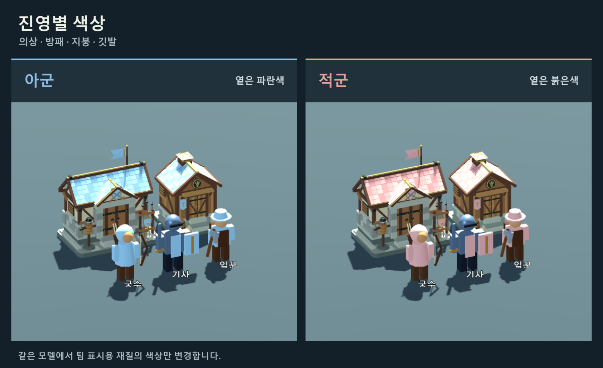

# 내 팀 기준 재질 색상

서버의 `WELCOME playerId team`으로 내 진영을 정하고, `UNIT`의 `team` 및 `BUILDING`의 `sideId`를 비교합니다. 같은 진영은 옅은 파랑(`#8DBDE3`), 다른 진영은 옅은 붉은색(`#E3A09B`)입니다. 내 팀이 2여도 같은 규칙을 적용합니다. 소유자는 조종 권한에만 사용하므로 같은 진영의 미니언과 다른 플레이어의 유닛도 아군 색입니다.

- 일꾼: 상의·소매·모자.
- 기사: 덧옷·방패. 철제 갑옷은 원래 재질을 유지합니다.
- 궁수: 튜닉·소매·후드.
- 회관·서플라이·병영: 지붕·깃발·진영 문장.
- 포탑: 깃발. 석재와 쇠뇌는 원래 재질을 유지합니다.

`visuals/TeamMaterials.cs`가 `Visual` 아래를 처음 한 번 탐색해 `StandardMaterial3D.ResourceName`이 `team_cloth`, `banner`, `roof`, `roof_mid`, `roof_light`인 재질만 복제합니다. 같은 오브젝트에서 하나의 원본을 쓰는 여러 부위는 복제본도 공유합니다. 원본 메시·재질은 수정하지 않으며, 피부·목재·금속·석재와 표면 질감은 보존합니다. 지붕의 세 재질은 기본 색의 80%·91%·100% 밝기로 기와 명암을 유지합니다.

현재 플레이어의 진영 또는 대상의 진영이 바뀔 때만 색을 갱신합니다. 위치 업데이트나 매 프레임마다 재질을 새로 만들지 않습니다. 아직 진영 정보를 받지 않았으면 원래 외형으로 표시하며, 뒤늦은 WELCOME에도 기존 오브젝트를 갱신합니다. 맵 재동기화·접속 종료 시 기존 오브젝트와 내 진영 정보를 초기화합니다.

서버 메시지 형식은 바꾸지 않습니다. 서플라이·병영 에셋도 동일한 색상 기능을 지원하지만, 두 건물의 서버 타입 등록·게임 내 배치는 기존과 같이 후속 작업입니다.

Godot에서 `previews/TeamColors.tscn`을 열고 F6으로 실행하면 동일한 모델의 아군·적군 색상을 비교할 수 있습니다. `-- --capture`로 실행하면 `docs/images/team-colors-preview.png`를 저장합니다. 이 미리보기는 내 진영을 2로 설정하여 팀 번호와 색상이 고정되지 않음을 보여줍니다.

검증: `dotnet build --no-restore`, `TeamColorChecks`, `BuildingSceneChecks`, `ProductionBuildingChecks`, `UnitSceneChecks`, `DeathAndTargetChecks`. 공유 재질 불변, 유닛 3종·건물 4종, 팀 변경·재접속·늦은 WELCOME과 기존 선택·사망 처리를 확인합니다.

